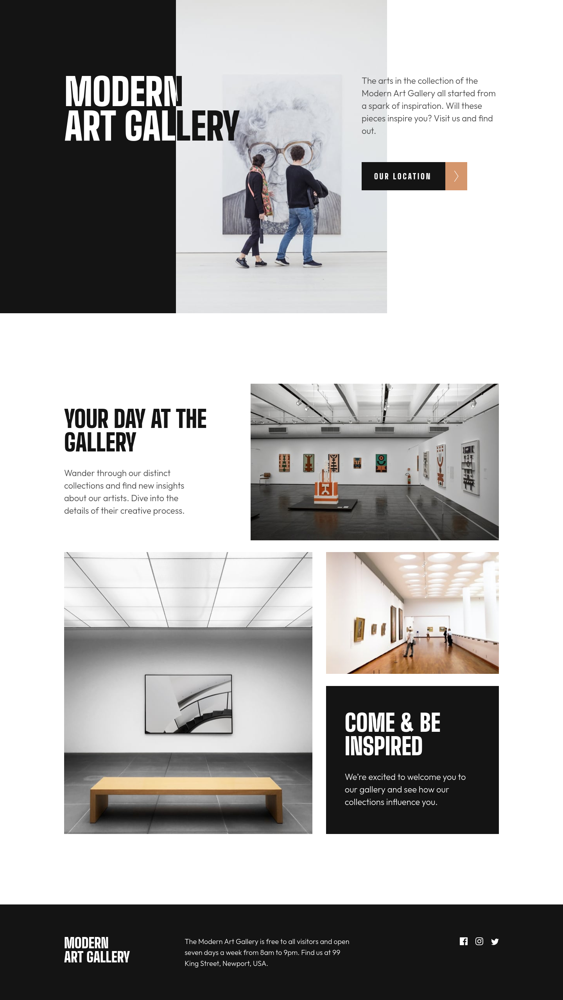

# Frontend Mentor - Art gallery website solution

This is a solution to
the [Art gallery website challenge on Frontend Mentor](https://www.frontendmentor.io/challenges/art-gallery-website-yVdrZlxyA).
Frontend Mentor challenges help you improve your coding skills by building
realistic projects.

## Table of contents

- [Overview](#overview)
	- [The challenge](#the-challenge)
	- [Screenshot](#screenshot)
	- [Links](#links)
- [My process](#my-process)
	- [Built with](#built-with)
	- [What I learned](#what-i-learned)

## Overview

### The challenge

Users should be able to:

- View the optimal layout for each page depending on their device's screen size
- See hover states for all interactive elements throughout the site

### Screenshot

### Links

- [Solution](https://www.frontendmentor.io/challenges/art-gallery-website-yVdrZlxyA/)
- [Live Site](https://razouck.github.io/art-gallery-website/index.html)

## My process

### Built with

- Semantic HTML5 markup
- CSS custom properties
- Flexbox
- CSS Grid
- Mobile-first workflow

### What I learned

I learned how to use the Leaflet libary. Unfortunately I could not find a map
tile such as the one shown in the project's pictures, so I settled with the
default one.

## Author

- Github - [@razouck](https://www.github.com/razouck)
- Frontend
  Mentor - [@razouck](https://www.frontendmentor.io/profile/razouck)
